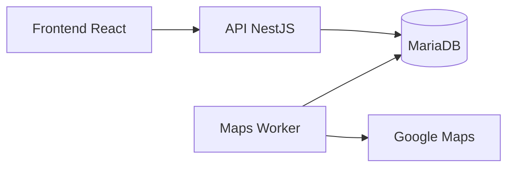

# Vue d'ensemble

```mermaid
flowchart LR
  Frontend[Frontend React] --> API[API NestJS]
  API --> DB[(MariaDB)]
  Worker[Maps Worker] --> DB
  Worker --> Google[Google Maps]
```

Le frontend consulte l'API. L'API persiste les balades et crée des jobs en base. Le worker traite les jobs séparément pour ne jamais bloquer les requêtes utilisateur.
