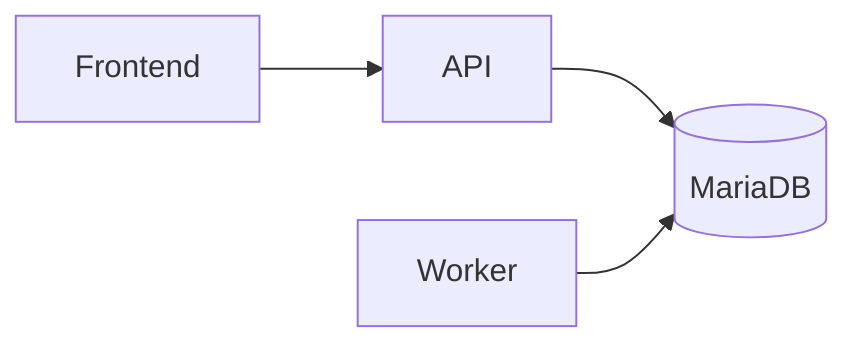

# Bootstrap monorepo

## Objectif métier

Créer un socle Ridebook lançable localement et déployable avec Docker Compose/Dokploy.

## Scope

**Inclus :** monorepo `pnpm`, apps `frontend`, `api`, `maps-worker`, packages partagés, Docker Compose, `.env.example`, documentation minimale.

**Hors scope :** authentification, CRUD balades, queue réelle et Selenium réel.

## Règles métier

Le bootstrap intègre les décisions de déploiement :

- MariaDB sans port publié côté hôte ;
- bind mounts locaux configurés par `.env` ;
- worker séparé de l'API ;
- aucun secret réel versionné.

## Architecture technique

## Implémentation

- Frontend : `apps/frontend`
- API : `apps/api`
- Worker : `apps/maps-worker`
- Contrats : `packages/contracts`
- Compose : `docker-compose.yml`

## Tests

| Niveau | Fichier | Couvre |
|---|---|---|
| Build | `pnpm -r build` | compilation des workspaces |
| Lint | `pnpm -r lint` | typage strict |
| Compose | `pnpm compose:config` | validité Docker Compose |
